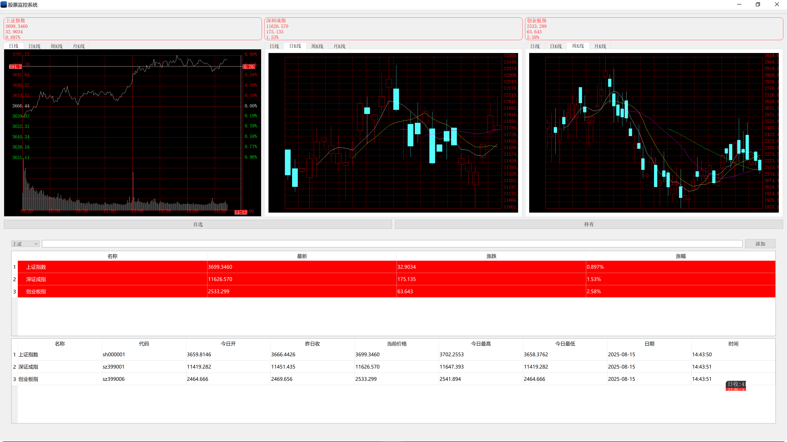

# 股票监控系统 (StockMonitoringSystem)

一个基于Qt框架开发的股票实时监控和K线分析系统，支持多种数据源和图表展示功能。

## 项目概述

本系统提供了完整的股票数据监控解决方案，包括实时分时图表、K线图表分析、多时间周期展示等功能。系统采用模块化设计，支持多个数据源API，确保数据获取的稳定性和准确性。



## 主要功能

### 📈 多维度图表展示
- **分时图表**：实时显示股票价格走势和成交量
- **日K线图**：显示每日开盘、收盘、最高、最低价格
- **周K线图**：显示每周K线数据和趋势
- **月K线图**：显示每月K线数据和长期趋势

### 📊 技术指标分析
- **移动平均线**：支持5日、10日、20日、30日、60日均线
- **成交量分析**：显示成交量柱状图和均量线
- **价格指标**：实时显示涨跌幅、振幅等关键指标

### 🔄 多数据源支持
- **腾讯财经API**：提供实时分时数据
- **东方财富API**：提供详细的历史数据
- **新浪财经API**：提供实时行情数据
- **网易财经API**：提供K线历史数据
- **智能降级**：API失败时自动切换备用数据源

### 🎯 交互功能
- **十字线工具**：鼠标悬停显示精确价格和时间
- **缩放功能**：支持键盘快捷键缩放时间范围
- **实时更新**：30秒自动刷新最新数据
- **多股票支持**：同时监控多只股票

## 技术架构

### 开发环境
- **框架**：Qt 5.15.2
- **语言**：C++
- **编译器**：MinGW 64-bit
- **网络库**：QNetworkAccessManager
- **图形库**：QPainter

### 项目结构
```
StockMonitoringSystem/
├── src/
│   ├── stockView/              # 分时图表模块
│   │   ├── stockcanvas.cpp     # 分时图表绘制
│   │   └── stockviewdata.cpp   # 分时数据处理
│   ├── stockKlineView/         # K线图表模块
│   │   ├── klinegrid.cpp       # K线图表绘制
│   │   ├── stockklineviewdata.cpp # K线数据处理
│   │   ├── datafile.cpp        # 数据文件处理
│   │   └── autogrid.cpp        # 网格绘制基类
│   ├── stackstock.cpp          # 主界面控制
│   └── main.cpp                # 程序入口
├── img/                        # 项目截图
└── README.md                   # 项目说明
```

### 核心模块

#### 1. 分时图表模块 (stockView)
- `StockCanvas`：负责分时图表的绘制和交互
- `stockViewData`：处理分时数据的获取、解析和管理
- 支持实时价格曲线、成交量柱状图、十字线工具

#### 2. K线图表模块 (stockKlineView)
- `KLineGrid`：负责K线图表的绘制和交互
- `StockKlineViewData`：处理K线数据的获取和解析
- `DataFile`：管理K线数据的存储和计算
- `AutoGrid`：提供网格绘制的基础功能

#### 3. 数据处理层
- 多API数据源管理
- 智能数据解析和格式转换
- 错误处理和降级机制
- 实时数据更新和缓存

## 安装和使用

### 系统要求
- Windows 10/11
- Qt 5.15.0 或更高版本
- MinGW 64-bit 编译器
- 网络连接（用于获取股票数据）

### 使用说明
1. **启动程序**：运行编译后的可执行文件
2. **选择股票**：程序默认显示上证指数、深证成指、创业板指等主要指数
3. **切换视图**：点击标签页切换不同的图表类型
   - 日线：分时图表
   - 日K线：日K线图表
   - 周K线：周K线图表
   - 月K线：月K线图表
4. **交互操作**：
   - 鼠标移动：显示十字线和价格信息
   - 左键点击：开启/关闭十字线
   - 方向键：移动十字线位置
   - 上下键：缩放时间范围

## 功能特性

### 🚀 性能优化
- **高效绘制**：优化的QPainter绘制算法
- **内存管理**：智能的数据缓存和清理机制
- **网络优化**：异步网络请求，避免界面卡顿

### 🛡️ 稳定性保障
- **多重备份**：多个数据源API确保数据获取稳定
- **错误处理**：完善的异常处理和恢复机制
- **数据验证**：严格的数据格式验证和边界检查

### 🎨 用户体验
- **响应式界面**：流畅的交互体验
- **直观显示**：清晰的图表和数据展示
- **实时反馈**：即时的价格和指标更新

## 最近更新 (2025/8/15)

### 🔧 问题修复
1. **K线显示问题**
   - 修复了日K、周K、月K线显示异常的问题
   - 优化了边界处理和索引计算逻辑
   - 改进了X轴步长计算方法

2. **分时图表优化**
   - 新增多个真实分时数据API
   - 实现智能数据源切换机制
   - 优化了数据解析和错误处理

3. **性能改进**
   - 减少了冗余的日志输出
   - 优化了绘制性能
   - 改进了内存使用效率

### 🆕 新增功能
- **多API支持**：腾讯、东方财富、网易、新浪等多个数据源
- **智能降级**：API失败时自动切换备用方案
- **真实数据**：获取真实的分钟级分时数据
- **模拟备份**：在无法获取真实数据时提供模拟数据

## 开发计划

### 短期目标
- [ ] 添加更多技术指标（MACD、RSI、KDJ等）
- [ ] 支持自定义股票代码输入
- [ ] 优化移动端显示效果
- [ ] 添加数据导出功能

### 长期目标
- [ ] 支持期货、外汇等其他金融产品
- [ ] 添加预警和通知功能
- [ ] 实现策略回测功能
- [ ] 开发Web版本


## 致谢

感谢以下数据提供商：
- 腾讯财经
- 东方财富
- 新浪财经
- 网易财经

---

**注意**：本系统仅供学习和研究使用，不构成投资建议。投资有风险，入市需谨慎。